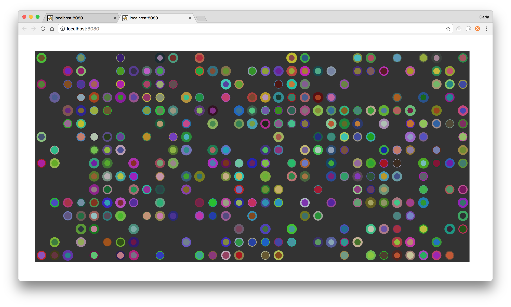

# 10PRINT #

The 10PRINT algorithm, consisting of a single line of code, was an extremely concise BASIC program written for the Commodore 64 (https://10print.org).

The following are two variations on the 10PRINT algorithm, written in P5js, and continue the exploration into the world of randomness and regularity:

* [Coloured Pattern Effect](https://github.com/Carla-de-Beer/P5js/tree/master/10-print/10-print-coloured-effect)
* [Gridded Circles](https://github.com/Carla-de-Beer/P5js/tree/master/10-print/10-print-gridded-circles)

 

  
  

