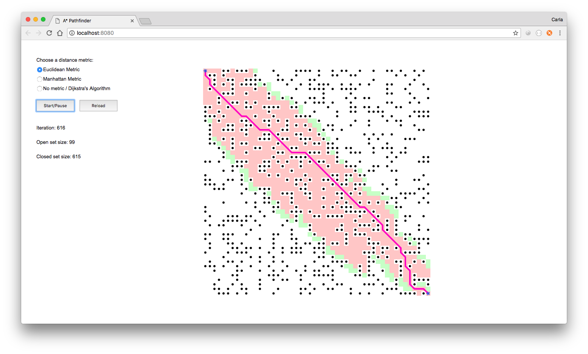

# A* Path Finding Algorithm

Simulation of the A* path finding algorithm. Choose between either of the following three distance metric options:
* Euclidean metric
* Manhattan metric
* No metric / Dijkstra's Algorithm

Based on Daniel Shiffman's Coding Train video example:
https://www.youtube.com/watch?v=aKYlikFAV4k&list=PLRqwX-V7Uu6ZiZxtDDRCi6uhfTH4FilpH&index=63

 

  
  
  

