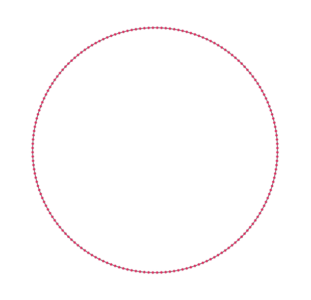

# Circle Morph: Steer #

Circle morphing (morphing a circle into a square, and back again, by means of steering). To run this sketch, also add the `particle.js` file to the main folder and uncomment the link in `index.html`.

Steer and arrive algorithms based on those by Daniel Shiffman ("Nature of Code").

 

 

