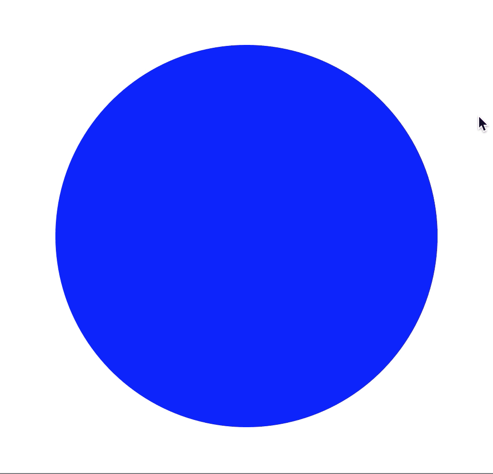

# Circle Morph: Vertex Removal #

Circle morphing (morphing a circle into a triangle, and back, through systematic vertex removal).

Based on Daniel Shiffman's Coding Train video example:
https://www.youtube.com/watch?v=0veqAiA61AU

 

 

