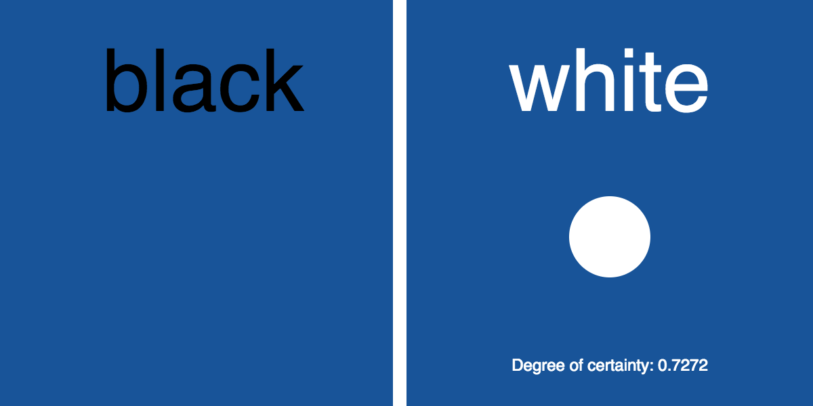
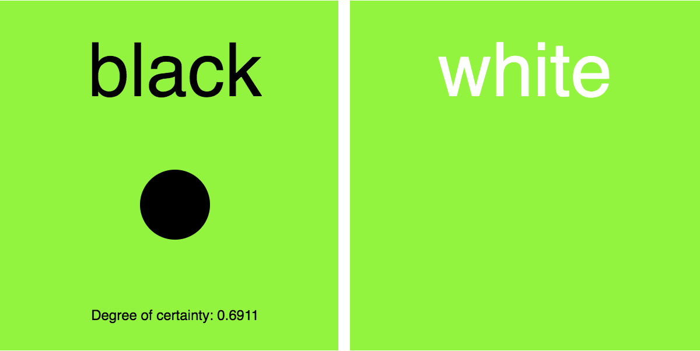
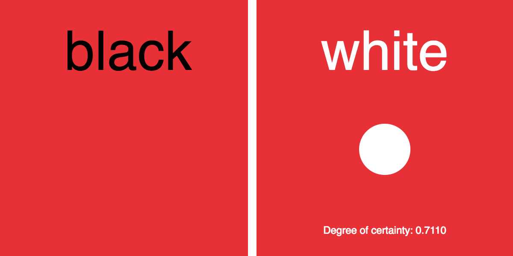

# Colour Predictor

Neural network that predicts whether white or black text is better suited to a given coloured background.

Based on Daniel Shiffman's Coding Train video example:
https://www.youtube.com/watch?v=KtPpoMThKUs

The code has been amended from example shown through the addition of the softmax functionality to the output nodes.

 

  
  
  
  
  
  

