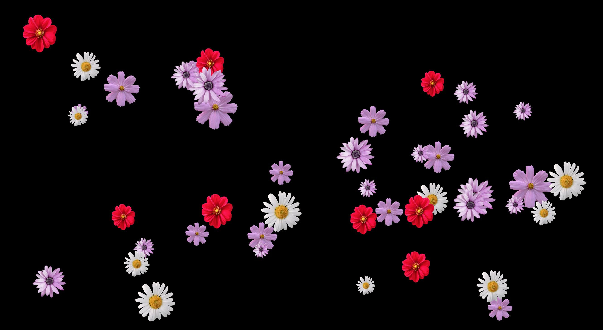

# Flower Power #

Creating a relationship between objects and images in P5js. Click on the flower heads to turn them into red dahlias.

Based on Daniel Shiffman's Coding Train video example:
https://www.youtube.com/watch?v=i2C1hrJMwz0

 

  

