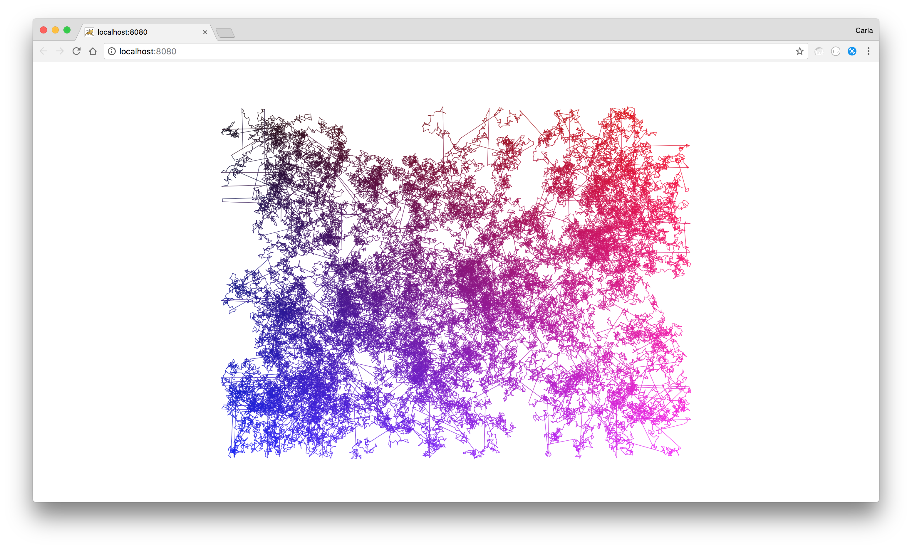
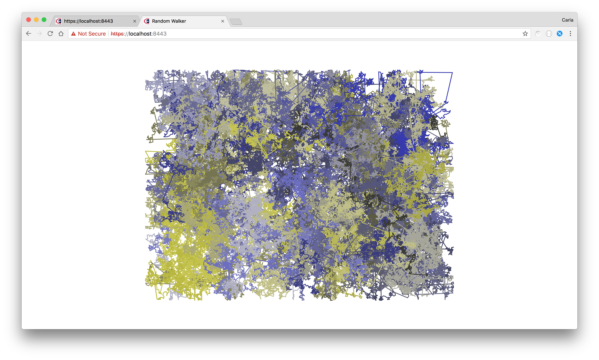
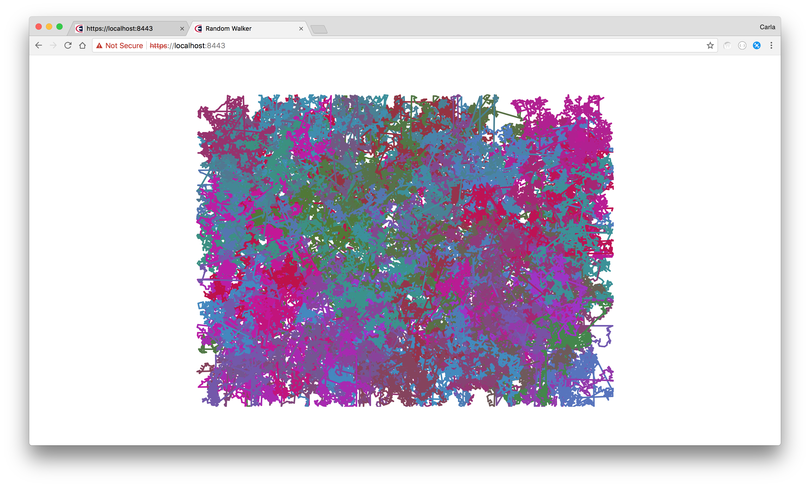
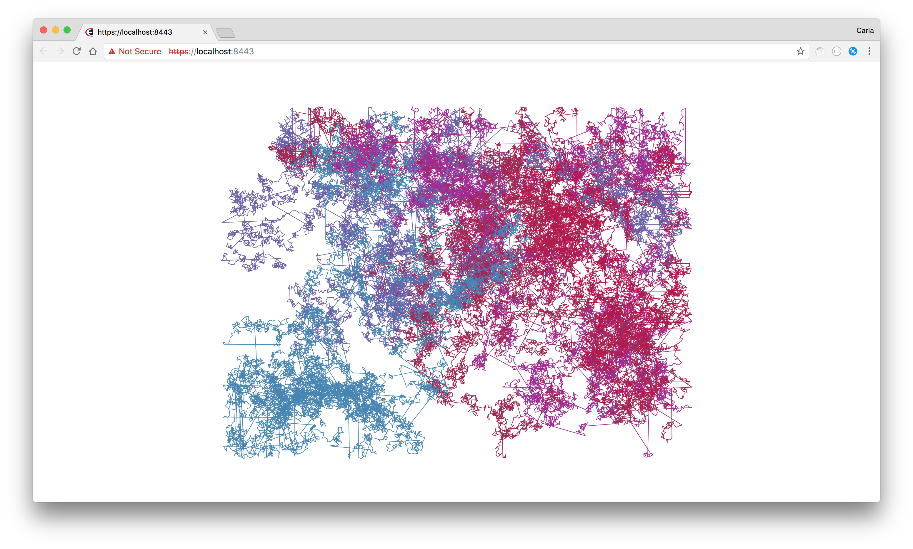

# Random Walks #

Random walks constructed with a random walker capable of a Lévy flight.

Swap out the script files to run the different options.

Based on Daniel Shiffman's Coding Train video example:
https://www.youtube.com/watch?v=bqF9w9TTfeo

## Random Walker ##

A single random walker whose path colour is based on its screen position.

(sketch-01.js)

 

  
  

## Random Walker ##

Multiple random walkers.

(sketch-02.js)

 

  
  

  
  

