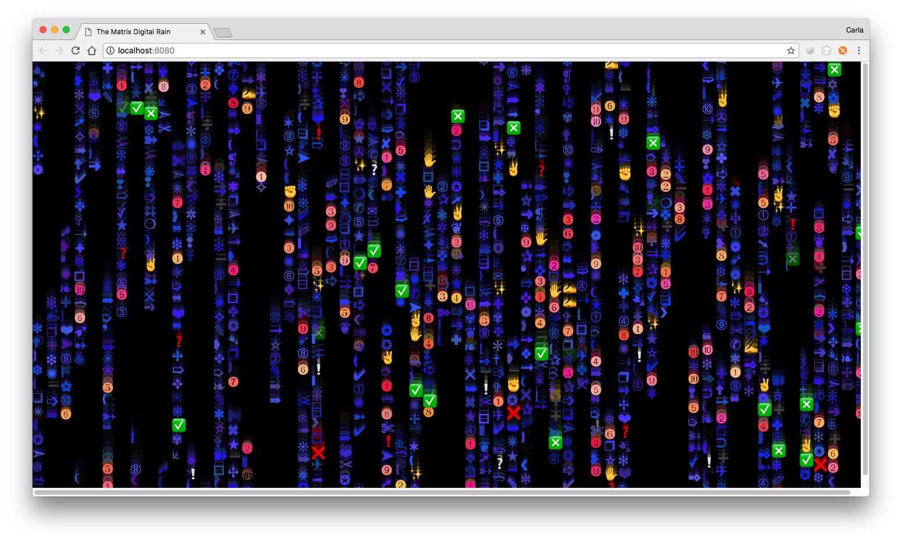

# "The Matrix" Digital Rain: Dingbats

Simulation of "The Matrix"'s Digital Rain using Dingbats.

Based on Emily Xie's Coding Train video example:
https://www.youtube.com/watch?v=S1TQCi9axzg

 

  

