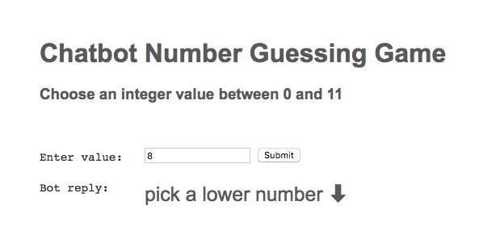
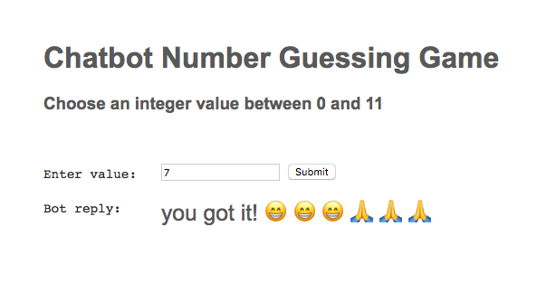

# Chatbot Number Guessing Game #

A simple chatbot number guessing game where the user has to enter a value between 0 and 10 to check whether it matches the Chatbot's number. The project makes use of the [RiveScript API](https://www.rivescript.com) to generate the Chatbot responses. This project also demonstrates the use of emojis within a P5js sketch.

Based on Daniel Shiffman's Coding Train video example:
https://www.youtube.com/watch?v=slmSCEho31g

 

  
  
  

