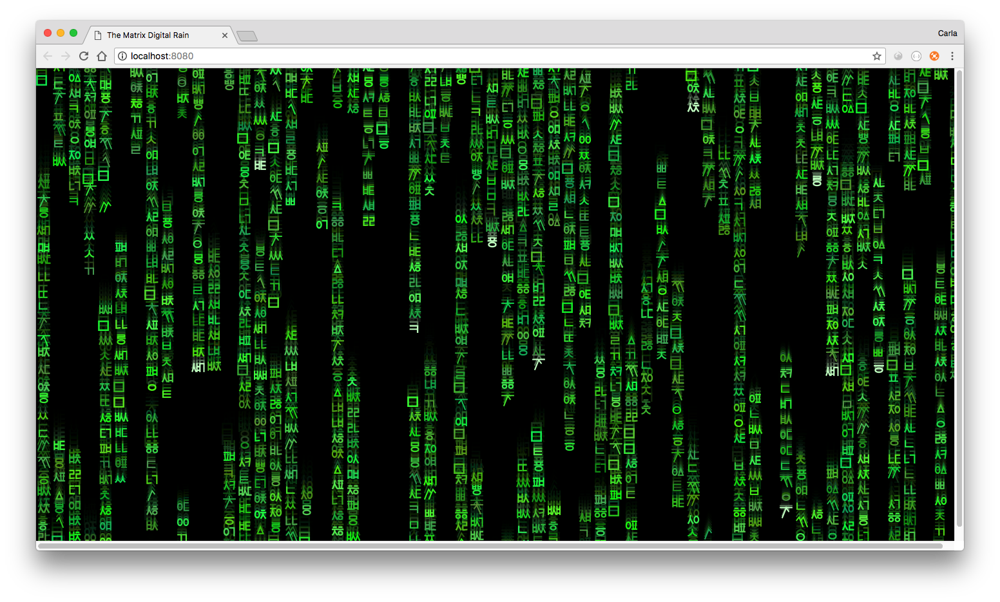

# "The Matrix" Digital Rain: Original Version with Various Scripts

Simulation of "The Matrix"'s Digital Rain using different scripts:
* Katakana (original version)
* Cyrillic
* Hangul

Based on Emily Xie's Coding Train video example:
https://www.youtube.com/watch?v=S1TQCi9axzg

## Examples generated:
 

  
  
  

